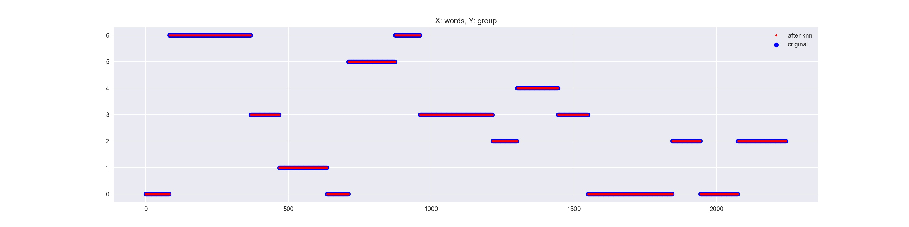

## Algorithm for extracting parts from a video by text and search query.

* First, keywords are selected from the test by frequency. (You can use just text instead of information from YouTube.)
* "Headlines" were built from important words
* Sorting by Kmeans
* Groups are compared for similarity to the query
* From suitable groups (parts of text), pointers are created in the text and in the video
* Video construction 

_Run code:_ python main.py "searching words"

-------
### K-Means clustering result:

### Word frequencies:

### Top 10 word frequencies:

### Possition / Frequency table:
`(row - possition in text; column - token)`

|    . |     a | about | action | actions | actual | ... | works | would | wrap | yet |   you | you'll | you're | you've | your | zero |
|:----:|------:|------:|-------:|--------:|-------:|----:|------:|------:|-----:|----:|------:|-------:|-------:|-------:|-----:|-----:|
|    0 | 1.146 |   0.0 |    0.0 |     0.0 |    0.0 | ... |   0.0 |   0.0 |  0.0 | 0.0 | 0.000 |    0.0 |  0.000 |  6.198 | 0.00 |  0.0 |
|    1 | 1.146 |   0.0 |    0.0 |     0.0 |    0.0 | ... |   0.0 |   0.0 |  0.0 | 0.0 | 0.000 |    0.0 |  0.000 |  6.198 | 0.00 |  0.0 |
|    2 | 1.146 |   0.0 |    0.0 |     0.0 |    0.0 | ... |   0.0 |   0.0 |  0.0 | 0.0 | 0.000 |    0.0 |  0.000 |  6.198 | 0.00 |  0.0 |
|    3 | 1.146 |   0.0 |    0.0 |     0.0 |    0.0 | ... |   0.0 |   0.0 |  0.0 | 0.0 | 0.000 |    0.0 |  0.000 |  6.198 | 0.00 |  0.0 |
|    4 | 1.146 |   0.0 |    0.0 |     0.0 |    0.0 | ... |   0.0 |   0.0 |  0.0 | 0.0 | 0.000 |    0.0 |  0.000 |  6.198 | 0.00 |  0.0 |
|  ... |   ... |   ... |    ... |     ... |    ... | ... |   ... |   ... |  ... | ... |   ... |    ... |    ... |    ... |  ... |  ... |
| 2226 | 0.539 |   0.0 |    0.0 |     0.0 |    0.0 | ... |   0.0 |   0.0 |  0.0 | 0.0 | 2.436 |    0.0 |  5.159 |  0.000 | 2.71 |  0.0 |
| 2227 | 0.539 |   0.0 |    0.0 |     0.0 |    0.0 | ... |   0.0 |   0.0 |  0.0 | 0.0 | 2.436 |    0.0 |  5.159 |  0.000 | 2.71 |  0.0 |
| 2228 | 0.539 |   0.0 |    0.0 |     0.0 |    0.0 | ... |   0.0 |   0.0 |  0.0 | 0.0 | 2.436 |    0.0 |  5.159 |  0.000 | 2.71 |  0.0 |
| 2229 | 0.539 |   0.0 |    0.0 |     0.0 |    0.0 | ... |   0.0 |   0.0 |  0.0 | 0.0 | 2.436 |    0.0 |  5.159 |  0.000 | 2.71 |  0.0 |
| 2230 | 0.539 |   0.0 |    0.0 |     0.0 |    0.0 | ... |   0.0 |   0.0 |  0.0 | 0.0 | 2.436 |    0.0 |  5.159 |  0.000 | 2.71 |  0.0 |
  
### Most words by frequency rating:
.|1	|2	|3	|4|	5
:---:|---|---|---|---|---
0	|webinar	|hopefully	|videos	|proximal	|reinforcement
1	|webinar	|hopefully	|videos	|proximal	|reinforcement
2	|udacity	|webinar	|hopefully	|videos	|proximal
3	|udacity	|webinar	|hopefully	|videos	|proximal
4	|udacity	|webinar	|hopefully	|videos	|proximal
...	|...	|...	|...	|...	|...
2226	|webinar	|tune	|slide	|we'll	|listening
2227	|webinar	|tune	|slide	|we'll	|listening
2228	|webinar	|tune	|slide	|we'll	|listening
2229	|webinar	|tune	|slide	|we'll	|listening
2230	|webinar	|tune	|slide	|we'll	|listening

### Timings output:
``[[(2.31, 279.64), (325.03, 396.74), (442.01, 825.73)]]``